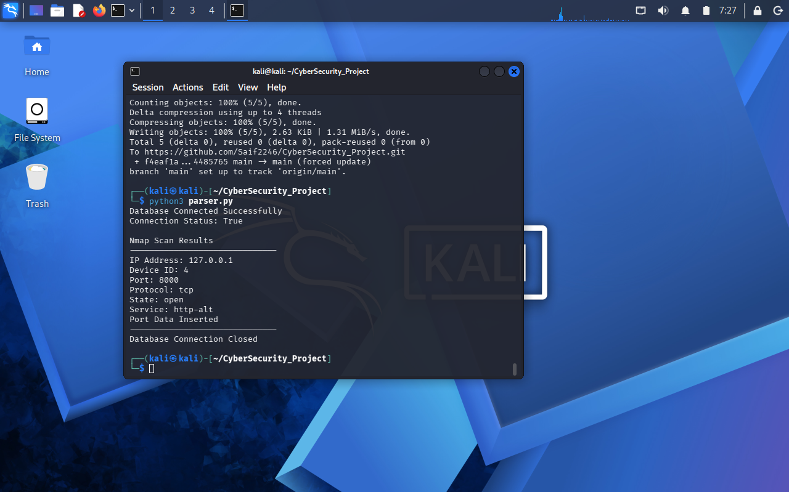

# Nmap XML Parser v1.1

A Python-based Nmap XML Parser that analyzes Nmap XML scan reports and stores network scan information into a MariaDB relational database.

## Project Overview

This project automates the process of reading Nmap XML output files and extracting important network information including:

- IP Addresses
- Open Ports
- Port States
- Running Services

The extracted information is stored in a structured MariaDB database for security analysis and reporting.

## Project Workflow

Nmap Scan → XML Report → Python Parser → MariaDB Database → GitHub Documentation

## Features

- Parses Nmap XML scan reports using Python
- Extracts host IP addresses
- Extracts port numbers and services
- Stores scanned devices in database
- Stores open ports with service details
- Uses relational database design with foreign key relationships
- Provides organized network scan data storage

## Technologies Used

- Python
- XML Parsing
- Nmap
- MariaDB / MySQL
- Kali Linux
- Linux Terminal
- Git & GitHub

## Database Structure

### Scanned_Devices Table

Stores discovered network devices:

- Device_ID
- IP_Address

### Open_Ports Table

Stores detected port information:

- Port_ID
- Device_ID
- Port_Number
- Service_Name
- Port_State

Device_ID creates a relationship between scanned devices and their open ports.

## Installation & Usage

### 1. Generate Nmap XML Scan

```bash
nmap -oX scan_result.xml target_ip
2. Run Python Parser
python3 parser.py
3. Database Output

The parser automatically inserts extracted scan results into MariaDB tables:

Scanned_Devices
Open_Ports
Project Screenshots
Nmap Parser Execution

Scanned Devices Database

Open Ports Database

Skills Demonstrated
Python Programming
XML Data Processing
Network Scanning
Nmap Usage
SQL Database Integration
Linux Environment
Network Security Fundamentals

Author

Saif Ali
